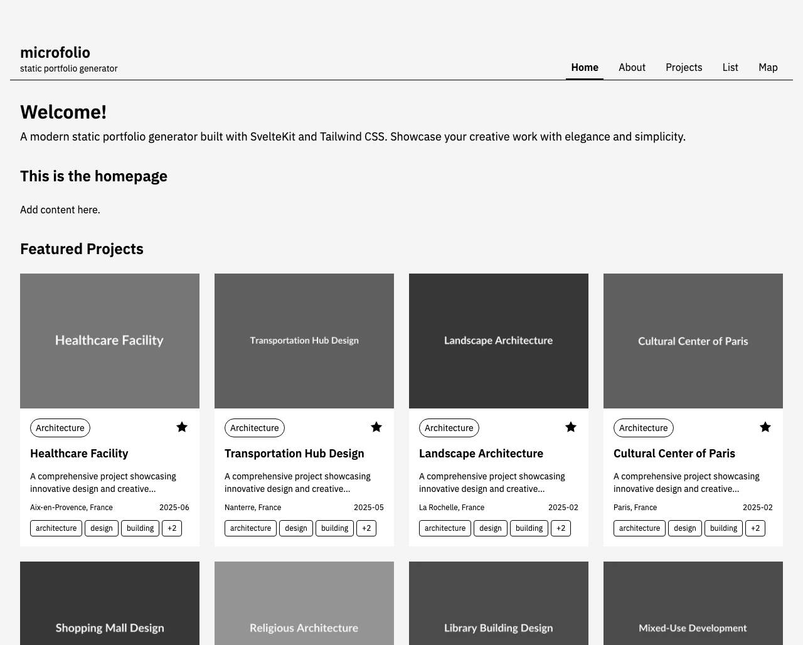

# microfolio

_[🇺🇸 Read in English](README.md)_

Un générateur de portfolio statique moderne développé avec **SvelteKit 2** et **Tailwind CSS 4** par AKER. Il intègre un système de gestion de contenu basé sur des fichiers utilisant des dossiers et des fichiers Markdown. Idéal pour les designers, artistes, architectes et créatifs qui souhaitent présenter leurs projets avec élégance et professionnalisme.

**Démo en ligne** : [https://aker-dev.github.io/microfolio/](https://aker-dev.github.io/microfolio/)

> **Nous recherchons des traducteurs !** Aidez-nous à rendre microfolio accessible dans plus de langues. Contactez-nous à **hello@aker.pro** si vous souhaitez contribuer une traduction.

## ✅ Fonctionnalités

- **📁 CMS basé sur des fichiers** — Pas de base de données, juste des dossiers et des fichiers Markdown
- **🎨 Vues multiples** — Grille de projets, Liste et Carte
- **📱 Design responsive** — Conçu avec une approche mobile-first
- **🏷️ Étiquetage intelligent** — Compteurs de filtres et liste de tags repliable
- **🗺️ Carte interactive** — Intégration Leaflet avec projets géolocalisés
- **🚀 Génération statique** — Performances optimales avec SvelteKit adapter-static
- **🖼️ Lightbox d'images** — Galerie améliorée avec flèches de navigation et affichage des métadonnées
- **📊 Métadonnées EXIF/IPTC** — Extraction et affichage automatique des informations techniques d'images
- **🌙 Mode sombre** — Toggle dans le footer avec préférence persistante (système / manuel / localStorage)
- **⚡ Optimisation des images** — Génération de thumbnails WebP avec `pnpm optimize-images`
- **🔗 URLs partageables** — Filtres, recherche, tri et pagination synchronisés dans les paramètres d'URL
- **🌐 Internationalisation** — Anglais/Français via svelte-i18n, support RTL
- **🏷️ Métadonnées OG** — Aperçus de partage social pour les projets et pages
- **📄 Pagination et tri** — Lignes par page personnalisable, tri par date, titre, type ou localisation

## 🧪 Programme de beta tests

**Nous recherchons des testeurs !** Vous êtes créatif et souhaitez tester microfolio ?

👉 **[Guide Beta-testeur](doc/fr/guide-beta-testeurs.md)** - Guide complet pour débuter

📧 Contactez **hello@aker.pro** pour rejoindre le programme de test.

## 🚀 Démarrage rapide

### Option 1 : Installation via Homebrew (macOS - Recommandée)

```bash
# Installer microfolio via Homebrew
brew install aker-dev/tap/microfolio

# Créer un nouveau portfolio
microfolio new mon-portfolio
cd mon-portfolio

# Lancer le serveur de développement
microfolio dev
```

### Option 2 : Installation manuelle

#### Prérequis

- Node.js 22.13 ou supérieur (requis par pnpm 11 ; testé avec 22.x et 24.x)
- Gestionnaire de paquets pnpm
- Git pour le contrôle de version

```bash
# Cloner le modèle
git clone https://github.com/aker-dev/microfolio.git mon-portfolio
cd mon-portfolio

# Installer les dépendances
pnpm install

# Lancer le serveur de développement
pnpm dev
```

📖 **Guide d'installation détaillé** : [doc/fr/01-installation.md](doc/fr/01-installation.md)

## 🖥️ Captures d'écran

### Page d'accueil



### Vues des projets


La lightbox affiche l'image en pleine hauteur, avec son titre, sa légende, son crédit et ses métadonnées EXIF dans un panneau qu'on ouvre à la demande :


### Vue liste


### Vue carte


### Mode sombre

Suit la préférence du système, avec un bouton dans le pied de page qui mémorise votre choix.


## 📚 Documentation

- **[Guide d'installation](doc/fr/01-installation.md)** - Installation et prérequis
- **[Configuration](doc/fr/02-configuration.md)** - Personnalisation du site
- **[Ajout de projets](doc/fr/03-ajout-projets.md)** - Créer et organiser vos projets
- **[Publication](doc/fr/04-publication.md)** - Déployer votre portfolio
- **[Guide Bêta-testeur](doc/fr/guide-beta-testeurs.md)** - Guide destiné aux bêta-testeurs

## 🚀 Déploiement

📖 **Guide de déploiement complet** : [doc/fr/04-publication.md](doc/fr/04-publication.md)

### Déploiement rapide sur GitHub Pages

```bash
# Construire le site
microfolio build  # ou pnpm build

# Activer GitHub Pages dans les paramètres du dépôt
# Pousser vers la branche main pour un déploiement automatique
```

## 🤝 Contribution

Les contributions sont les bienvenues ! N'hésitez pas à forker le projet, créer une branche de fonctionnalité et soumettre une Pull Request.

### Fonctionnalités récentes (v0.9.0)

- Lightbox refondue : l'image occupe toute la hauteur de l'écran, titre, légende et métadonnées EXIF dans un panneau qui s'ouvre à la demande
- Les titres de projet et les badges de type et de tags sont des liens vers la vue projets, déjà filtrée
- Les vues liste et projets rendent leur contenu côté serveur — visible des moteurs de recherche et sans JavaScript
- Utilisable sur téléphone : les filtres se replient derrière un bouton et les lignes de la liste deviennent des cartes
- Focus clavier visible, et contrôles repliables qui annoncent leur état

> Node.js 22.13 ou supérieur est requis (dépendance de pnpm 11).

## 📞 Support

- 🐛 **Problèmes** : [GitHub Issues](https://github.com/aker-dev/microfolio/issues)
- 📧 **Email** : hello@aker.pro
- 💬 **Discussions** : GitHub Discussions pour vos questions

## 📄 Licence

Licence MIT - Consultez le fichier [LICENSE](LICENSE) pour plus de détails.

---

**Développé avec ❤️ par AKER**
