# microfolio

_[🇫🇷 Lire en français](LISEZMOI.md)_

[](https://github.com/aker-dev/microfolio/actions/workflows/deploy.yml)

A modern static portfolio generator built with **SvelteKit 2** and **Tailwind CSS 4** by AKER. Features a file-based content management system using folders and Markdown files. Perfect for designers, artists, architects, and creatives who want to showcase their projects elegantly and professionally.

**Live Demo**: [https://aker-dev.github.io/microfolio/](https://aker-dev.github.io/microfolio/)

> **We're looking for translators!** Help us make microfolio accessible in more languages. Contact us at **hello@aker.pro** if you'd like to contribute a translation.

## ✅ Features

- **📁 File-based CMS** › No database needed, just folders and Markdown files
- **🎨 Multiple Views** › Projects grid, List, and Map modes
- **📱 Responsive Design** › Mobile-first approach
- **🏷️ Smart Tagging** › Filter counters and collapsible tag list
- **🗺️ Interactive Map** › MapLibre GL with geolocated projects, light and dark, on an OpenStreetMap basemap
- **🚀 Static Generation** › Optimal performance with SvelteKit adapter-static
- **🖼️ Image Lightbox** › Enhanced gallery with navigation arrows and metadata display
- **📊 EXIF/IPTC Metadata** › Automatic extraction and display of image technical information
- **🌙 Dark Mode** › Toggle in footer with persistent preference (system / manual / localStorage)
- **⚡ Image Optimization** › WebP thumbnails and sharing images, generated as part of the build
- **🔗 Shareable URLs** › Filter, search, sort, and pagination state synced to URL query params
- **🌐 Internationalization** › English/French via svelte-i18n, RTL-ready
- **🏷️ Built to be shared and found** › Open Graph and Twitter tags with absolute URLs, canonical links, and a `sitemap.xml` and `robots.txt` generated from your projects
- **🔒 No cookies, no consent banner** › nothing is tracked, so there is nothing to ask permission for. Legal notice and privacy pages come as templates to fill in. A YouTube or Vimeo address alone on its line becomes a player, routed through the platforms' no-cookie modes
- **📄 Pagination & Sorting** › Customizable rows-per-page, sort by date, title, type, or location

## 🔒 Privacy by construction

A portfolio should not spy on its readers, and this one cannot.

- **No cookies.** `document.cookie` appears nowhere in the codebase
- **No analytics**, no tracking scripts, no forms. The demo embeds one YouTube video, in YouTube's no-cookie mode — and says so in its privacy page
- **No consent banner, because none is required.** The only thing kept on a
  visitor's device is the light/dark choice they made themselves, in
  `localStorage` under `theme`. French rules exempt an interface preference of
  that kind from consent — it does only what the visitor asked for
- **No Google Fonts.** The typeface comes from Bunny.net, a third-party CDN,
  which therefore receives visitors' IP addresses like any file server would.
  This is declared in the privacy template rather than glossed over
- **A map with no API key and no account** › OpenFreeMap, on OpenStreetMap data.
  Its tiles are fetched only on the map page

The generated site ships `content/legal.md` and `content/privacy.md` as
templates. **Fill them in**: publishing someone else's legal notice is worse
than publishing none.

## ⚡ Fast, and findable

Every page is prerendered: the content is in the HTML, so it is readable without
JavaScript and search engines see it without executing anything.

Measured on the published demo, on a phone-sized viewport throttled to slow 4G
with a 4× slower CPU — the conditions PageSpeed uses, median of three runs:

| Page     | First paint | Largest paint | Blocking |
| -------- | ----------- | ------------- | -------- |
| Home     | 780 ms      | 780 ms        | 0 ms     |
| Projects | 808 ms      | 808 ms        | 26 ms    |
| List     | 808 ms      | 808 ms        | 45 ms    |
| Map      | 884 ms      | 884 ms        | 589 ms   |

**The map is the exception, and honestly so**: a mapping engine is around
380 kB compressed, and no amount of tuning makes that free. Every other page
carries almost nothing.

What gets it there: thumbnails and 1200×630 sharing images generated at build,
the webfont fetched in parallel rather than behind the stylesheet, video that
downloads only when played, and images that reserve their space so nothing jumps.

For search engines and shared links: a title, description, canonical link and
Open Graph and Twitter tags on every page, plus a `sitemap.xml` and `robots.txt`
generated from your own projects.

## 🚀 Quick Start

### Option 1: Homebrew Installation (macOS - Recommended)

```bash
# Install microfolio via Homebrew
brew trust aker-dev/tap
brew install aker-dev/tap/microfolio

# Create a new portfolio
microfolio new my-portfolio
cd my-portfolio

# Start the development server
microfolio dev
```

### Option 2: Manual Installation

#### Prerequisites

- Node.js 22.13 or later (required by pnpm 11; tested with 22.x and 24.x)
- pnpm package manager
- Git for version control

```bash
# Clone the template
git clone https://github.com/aker-dev/microfolio.git my-portfolio
cd my-portfolio

# Install dependencies
pnpm install

# Start development server
pnpm dev

# Optional: unzip the thirty projects of the demo site next to yours
pnpm demo
```

📖 **Detailed installation guide**: [doc/en/01-installation.md](doc/en/01-installation.md)

## 📚 Documentation

- **[Getting Started](doc/en/00-getting-started.md)** - Beginner's guide, no terminal experience required
- **[Installation Guide](doc/en/01-installation.md)** - Installation and prerequisites
- **[Configuration](doc/en/02-configuration.md)** - Site customization
- **[Preparing Your Images](doc/en/03-preparing-images.md)** - Sizes, formats and metadata
- **[Adding Projects](doc/en/04-adding-projects.md)** - Create and organize projects
- **[Publishing](doc/en/05-publication.md)** - Deploy your portfolio

## 🚀 Deployment

📖 **Complete deployment guide**: [doc/en/05-publication.md](doc/en/05-publication.md)

### Quick Deploy to GitHub Pages

```bash
# Build the site
microfolio build  # or pnpm build

# Enable GitHub Pages in repository settings (Source: GitHub Actions)
# Push to main — automatic deployment
```

### Updating

A release is a new engine; your content and settings stay yours. From your site, with everything committed:

```bash
pnpm update-microfolio
```

It applies the release file by file, never touches `content/`, `config.js`, your favicon or your sharing image, and leaves a `.upstream` copy wherever your edits and ours collide. Details in the [publication guide](doc/en/05-publication.md#3-updating-microfolio).

## 🧭 Stability

1.0 is a promise: what you build on stays valid until 2.0.

**Frozen until 2.0**

- The content layout — `content/projects/<slug>/index.md` with its `images/`, `videos/` and `documents/` — and the frontmatter keys: `title` and `date` required, everything else optional
- The keys of `src/lib/config.js`: new ones may appear, none is renamed or removed
- The commands: `pnpm dev`, `build`, `deploy`, `demo`, `update-microfolio`, `optimize-images`, and their `microfolio` counterparts
- What `pnpm update-microfolio` never touches: `content/`, `src/lib/config.js`, `static/favicon.svg`, `static/og.jpg` and `.env` files

**Free to evolve in 1.x**: the look, the dependencies, the internals, the demo content, the interface texts. A change that would break the list above is a 2.0, and will say so.

## 🤝 Contributing

microfolio is built in the open, and every kind of help counts:

- 🐛 **Found a bug?** [Open an issue](https://github.com/aker-dev/microfolio/issues)
- 💡 **Have an idea?** [Start a discussion](https://github.com/aker-dev/microfolio/discussions)
- 🌍 **Speak another language?** Help translate microfolio — write to **hello@aker.pro**
- 🔧 **Want to code?** Fork the project, create a feature branch, and submit a Pull Request

See **[CONTRIBUTING.md](CONTRIBUTING.md)** for the details, and the **[changelog](CHANGELOG.md)** for what's new.

## 📞 Support

- 🐛 **Issues**: [GitHub Issues](https://github.com/aker-dev/microfolio/issues)
- 💬 **Questions**: [GitHub Discussions](https://github.com/aker-dev/microfolio/discussions)
- 📧 **Email**: hello@aker.pro

## 📰 They talked about microfolio

- **Korben** › [Microfolio, le portfolio statique qui regarde WordPress de haut](https://korben.info/microfolio-portfolio-statique-mate-wordpress-haut.html)
- **Entreprendre à Montpellier** › [Microfolio : l'innovation montpelliéraine qui réinvente le portfolio en ligne](https://entreprendre-montpellier.eolas-65.montpellier.fr/actualites/microfolio-linnovation-montpellieraine-qui-reinvente-le-portfolio-en-ligne)

Thank you, Korben, for the article — and thank you to the beta testers whose feedback shaped everything between 0.1 and 1.0.

## 🖼️ Built a site with microfolio?

Show it! Post it in [Show and tell](https://github.com/aker-dev/microfolio/discussions/categories/show-and-tell) or write to **hello@aker.pro** — a wall of fame of sites made with microfolio is in the making, and yours belongs on it.

## 🙏 Heritage

microfolio owes its founding idea to **[Subfolio](https://github.com/area17/subfolio)** by [Area 17](https://area17.com): a portfolio that is nothing more than a folder of files, shown well. Subfolio proved the idea years ago; microfolio carries it into a static, privacy-first generator for today's web. Thank you, Area 17.

## 📄 License

MIT License - See [LICENSE](LICENSE) file for details.

## 🖥️ Screenshots

### Homepage

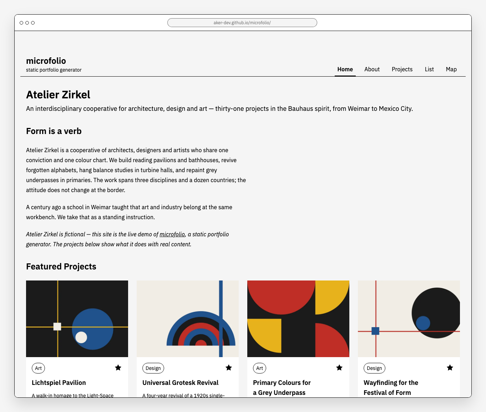

### Project Views

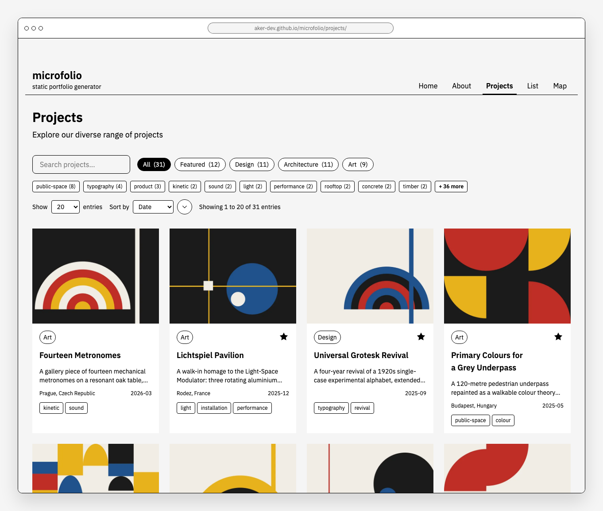
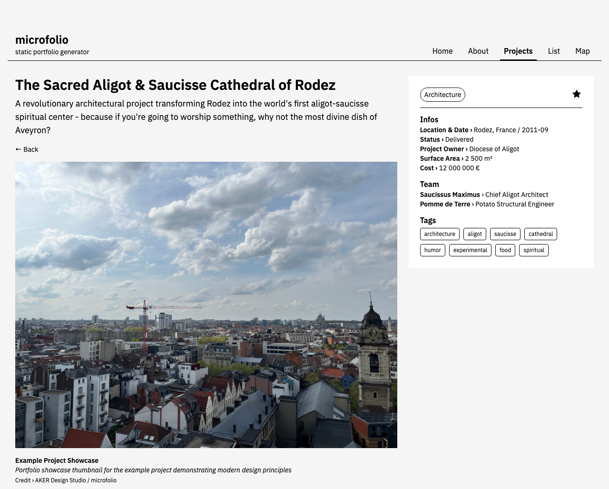
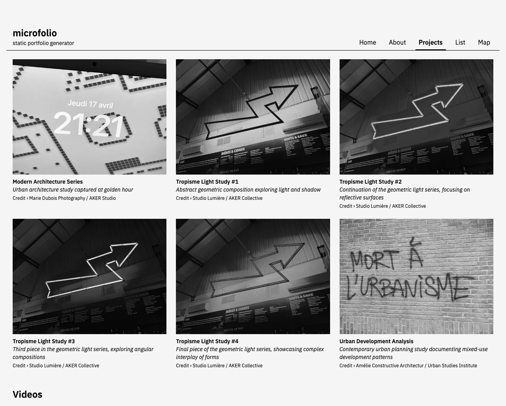

The lightbox shows the image full height, with its title, caption, credit and EXIF metadata in a panel you open when you want it:

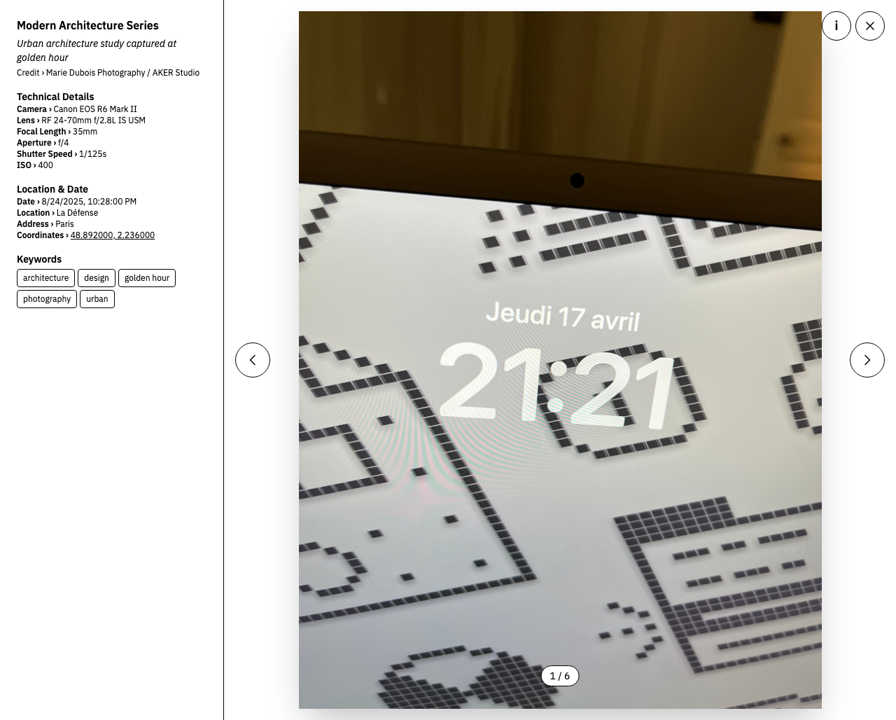

### List View

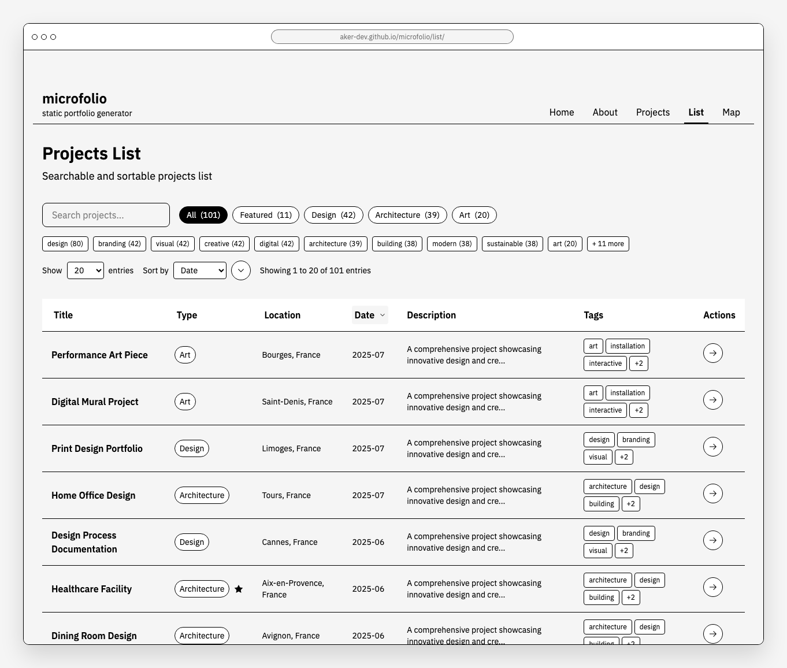

### Map View

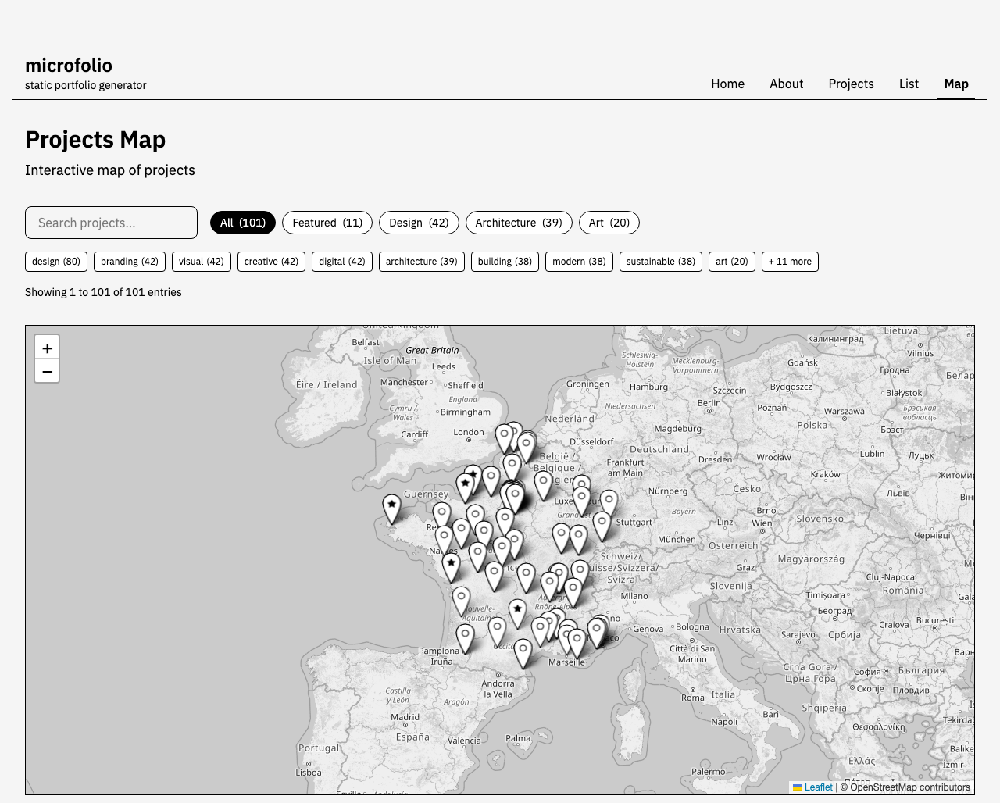

### Dark Mode

Follows the system preference, with a toggle in the footer that remembers your choice.

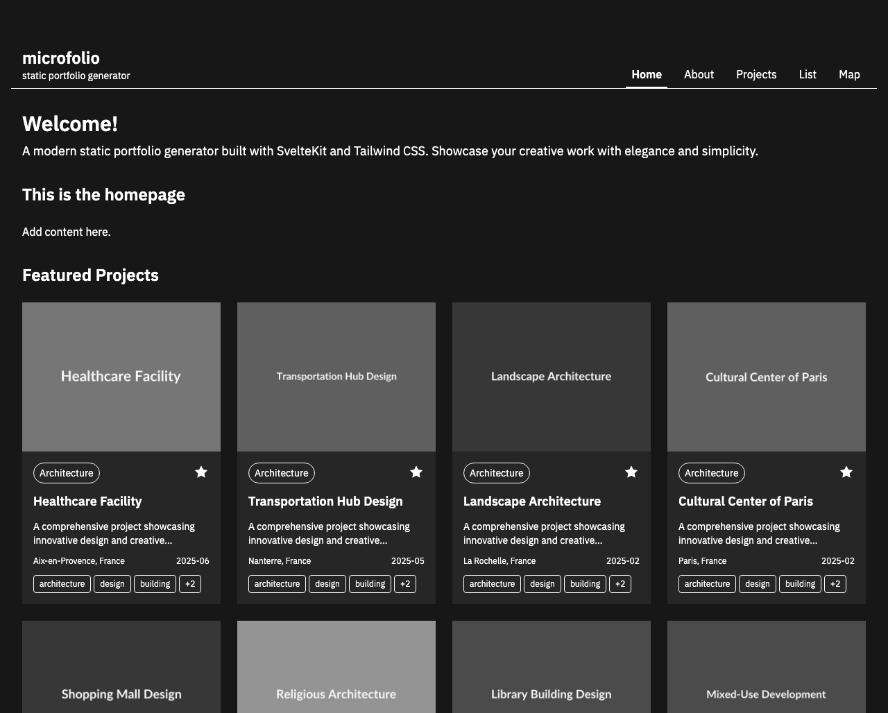
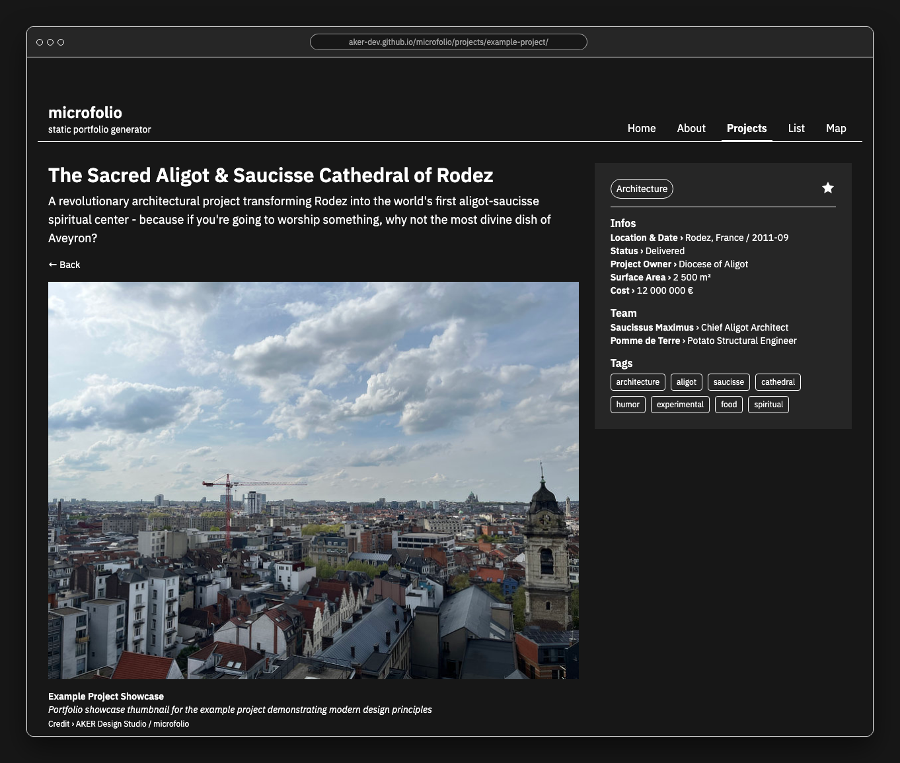
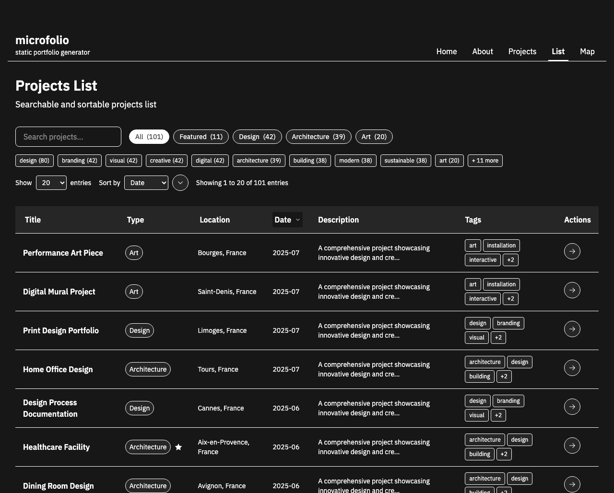
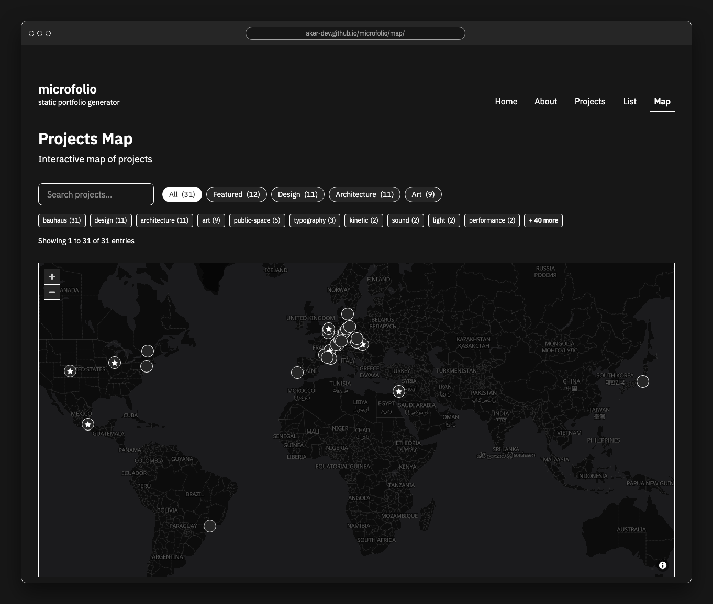
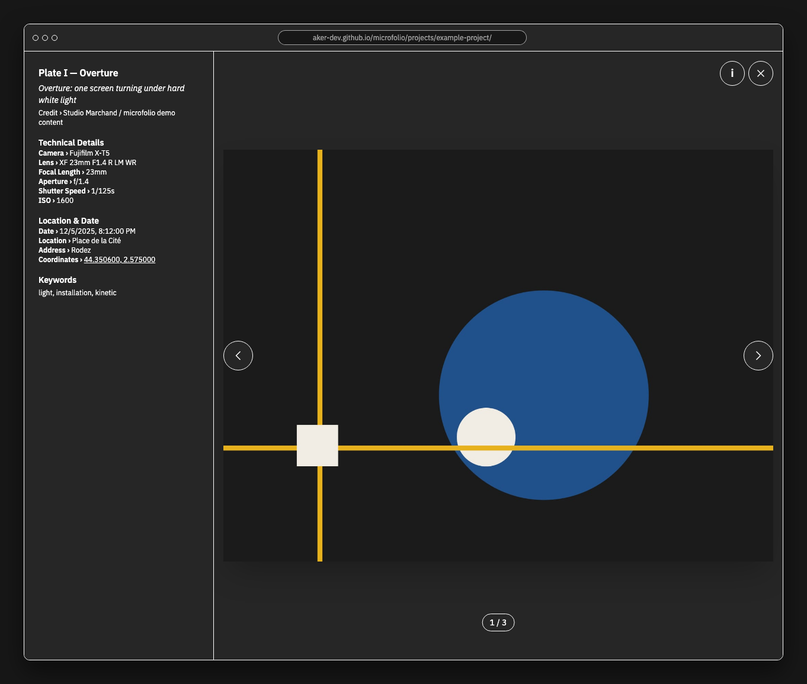

---

**Made with ❤️ by AKER**
