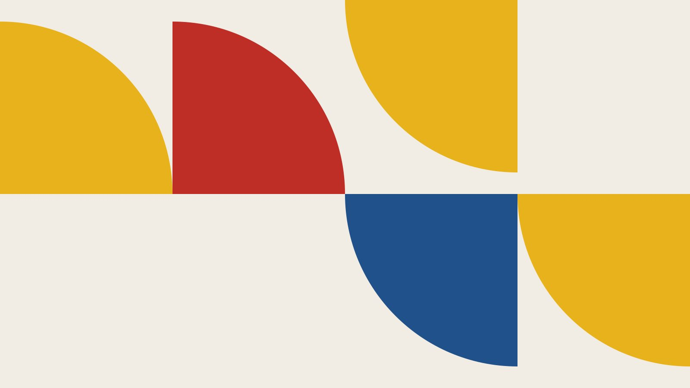

**microfolio** is a static portfolio generator for creatives — architects,
designers, artists, photographers, makers. You keep your work as folders of
Markdown and images; it builds the site: the grid, the list, the map, the
lightbox.

This is **version 1.0, code name _Bauhaus_** — the first stable release, and
the reason this demo wears primary colours. Every project below belongs to the
_Bauhaus collection_, thirty-one fictional works generated to show the tool
doing its job.

## Four convictions

1. **Your work lives in your files.** Folders, Markdown, images. No database,
   no export button, nothing to lose.
2. **Static is enough.** A portfolio is a body of work, not an application.
   Plain pages load fast and run anywhere.
3. **Nobody is watched.** No cookies, no trackers, no analytics. Showing your
   work does not require collecting your visitors'.
4. **Free and open source.** MIT licensed, forever.

## Start yours

- [microfolio.net](https://microfolio.net) — what it is, in two minutes
- [Getting started](https://github.com/aker-dev/microfolio/tree/main/doc) —
  install it and publish your first project
- [GitHub](https://github.com/aker-dev/microfolio) — the code, the issues, the
  discussions
